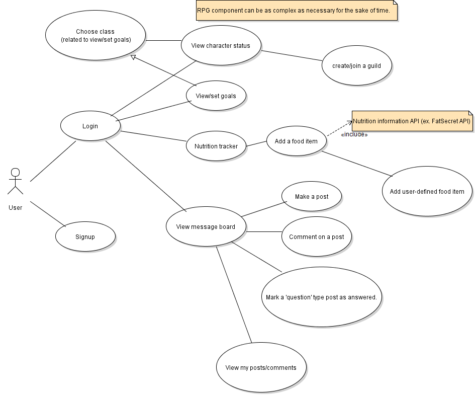

  

# Overview

Nutrtionknights is a platform that warriors will unite to defeat evil monseters that threaten the kingdom.
Succeeding health task such as: 
- Meeting daily calorie goals, 
- Meeting macro goals,
- Helping people on the message board,
- and much more

will fuel the knights in destroying the monsters.

## MVP

- Leverages FatSecret Api to get food nutrition.
- Users
  - Users will be able to Sign up log in
    - They will have a choice of questioner (that will ask health goals) or just choosing class (High protien : Warrior, Mage : Higher Carb, Tank: Keto ...)
  - Users will be able to enter their health data
    - BMI
    - Daily Calories
    - Macros
  - Users will be able to add their own foods.
  - Users will be able to add meals.
    - If you help a user it will count as succeeding a task
  - Succeeding tasks fights monster
  - Home dynmaic can tell meal time
  - basic animation
- Admin
  - Admin will be able to ban users.
## Stretch goal
 - Set and accomplish fitness goals.
- Cosmetic store
- Responsive design
- Report Users
- Will be able to see Avartar
- Users can create a guild.
- Users can join guilds that fight boss monsters.
- Admin will be able to mute users.
- Users can create fitness questions on message board
- dynmaic weight loss periods
- Monster level
- profile pic
- weekly goals

## Use Cases

## Contributors
- Eric Phu
- Will
- Pelin
- Nouman

